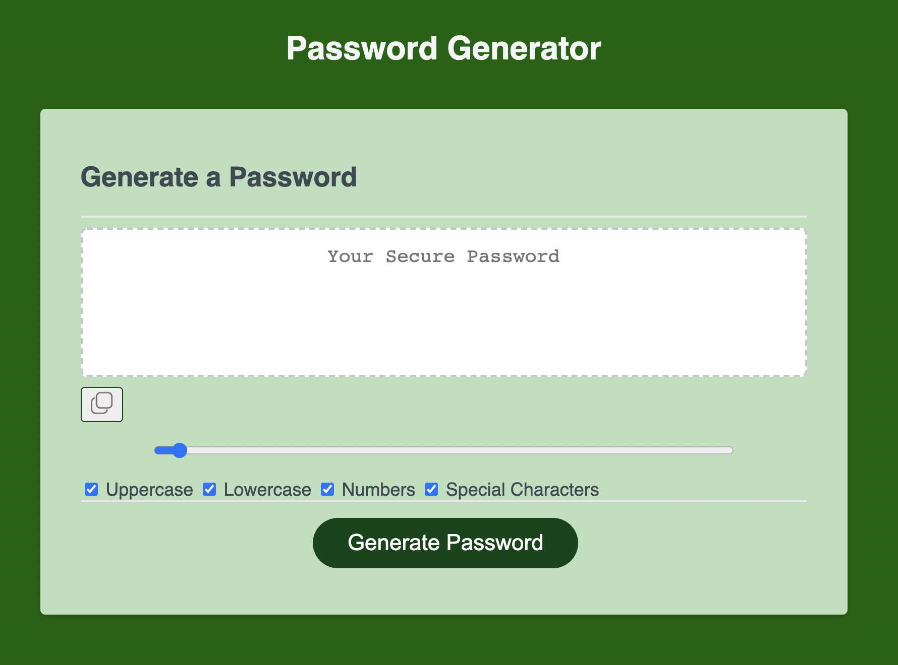

# geoffrey-johnson-portfolio
Password Generator

## Table of Contents
* [Description](#description)
* [Screenshot](#screenshot)
* [Link](#link)
* [Code](#code)
* [Contact](#contact)
* [Technologies](#technologies)
* [Project Status](#project-status)

## Description 
Creates a random password of 8 to 128 characters with user-chosen character types.

## Screenshot

## Link
[Password Generator Website](https://johny49.github.io/password-generator)

## Code
[GitHub Code Repository](https://github.com/Johny49/password-generator)

## Contact 
Created by [@johny49](https://github.com/Johny49/) - feel free to contact me!

## Technologies
- HTML
- CSS
- JS

## Project Status
Project is: completed and functioning as intended.
